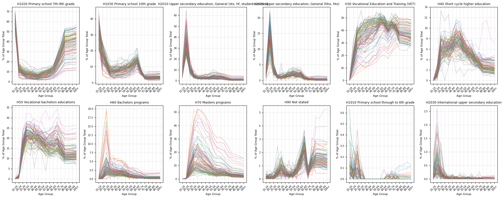

# cssci-capstone-app

# Stratification frame
A stratification frame is a list of mutually exclusive and exhaustive cells. Each cell is described by a mutually exclusive set of combined characteristics (e.g. age, sex, education, income, municipality). Each cell is likewise associated with an N representing how many of a given cell exist in a population.

A sample cell might look like:

| Age   | Sex | Education   | Income  | Municipality | N   |
| ----- | --- | ----------- | ------- | ------------ | --- |
| 24-35 | M   | High school | 100,000 | Middelfart   | 355 |

## Denmark
In order to build the initial skeleton frame for all of Denmark (excluding Greenland and the Faroe Islands), we take three tables from Denmark's StatBank. 
1. [FOLK1D](http://www.statbank.dk/FOLK1D) - this table contains the "true N" by municipality, gender, and age. We take it as the true N, as it contains a column denoting citizenship (i.e. our voting population). We take the most recent available data (2026Q1).
2. [HFUDD11](https://www.statbank.dk/hfudd11) - this table contains educational attainment by municipality, gender, and age (ages 15-69). This is our relative N as it; a) contains older data (2024 latest), b) does not distinguish between citizens.
3. INCOME TABLE - NOT DONE. Take some table from the INKDP.

The FOLK1D (population table) is preprocessed by translating the columns, dropping regions to leave only the municipalities and recoding the age column to match the 5 year age groups in HFUDD11 (education table).

The education table is then preprocessed by dropping the granular education rows to match the granularity in the Danish National Election Survey.

### Combining Population Table with the Education Table
To combine the population table with the education table, we first calculate the proportion of a certain age, municipality and gender cell that has a certain education. For example, if there are 100 men aged 20-24 in the Bornholm municipality in our relative N, and 60 of them have a bachelor's degree, if our true N = 200, we will multiply to get: $true \ N = 200 * (\frac{60}{100}) = 120$. 

Given that our table goes up to 69 years old, there are 20+ years missing from the education data. To solve this, we take the HFUDD11 data going back to 2009, when it cuts off and we assume that the 65-69 year olds of 2019 did not get any higher education than they had 5 years ago. We thus apply this logic to 2019, 2014, and 2009 to get the education of age cohorts in 2024 aged 70-74, 75-79 and 80-84 respectively. We assume that 85+ year olds have the same education as 80-84 year olds. This results in an education distribution across age and municipalities that looks like the following. This means that the data for 3.3% of the population (those above 84) is synthesised in this manner.

## Sweden

### Data Sources
Three tables from SCB's Statistics Database, all using 2024 data (latest available):

1. TAB638 — Population by municipality, age (5-year bins), sex, and marital status (marital status not used)
2. TAB6569 — Population by municipality, sex, and Swedish/other citizenship
3. TAB4320 — Education by municipality, age (10-year bins, 16–95+), sex, and education level

### Methods

#### 1. Recoding and Alignment with SNES
Variable categories are taken from register variables (prefix V-) rather than self-reported survey responses, as the SNES questions have already been adjusted based on these register variables. Factor levels in the survey must match those in the poststratification table - the standard solution when they don't align is to use the coarser of the two categorizations. SNES categories are therefore used as the common denominator throughout.
Since proportions of predictor profiles must sum to one per geographic unit, it's better to use smaller boundary approximations than to split bins across categories.

**Age (V7202)**: The SCB 20–24 bin maps entirely into SNES 18–22, and 30–34 maps entirely into SNES 31–40 (slight approximation).

**Education (V7302)**: "Upper secondary ≤2yr" and "Upper secondary 3yr" collapse into one SNES bin as the register data makes the same collapse. For the 95–99 and 100+ age groups, education distributions are taken from SCB's 95+ aggregate bin since TAB4320 doesn't disaggregate beyond that. This affects roughly 0.28% of the population.

#### 2. Combining Population, Citizenship, and Education
Population counts (TAB638) are scaled by the citizenship share (TAB6569) to get an estimated citizen count per municipality x age x sex cell. Education shares (TAB4320) are then applied within each cell to split counts across education categories, giving the final N per cell. The 5-year age bins from TAB638 are bridged to the 10-year bins in TAB4320 before joining.

#### 3. Income
Income is not included in the frame. The most recent SCB income data ([SamForvInk1](https://www.statistikdatabasen.scb.se/pxweb/en/ssd/START__HE__HE0110__HE0110A/SamForvInk1/)) is from 2020, which would be inconsistent with the 2024 sources and could make the frame sparse. It could instead be added on the SNES side as an individual-level fixed-effect covariate using survey respondents' self-reported values.

#### 4. Past Vote (V7000)
SNES past vote data is only available at the constituency level (29 constituencies), so it can't be used to augment the municipality-level frame directly. Instead, past vote comes from the official 2022 Riksdag election results by electoral district. Electoral district codes are matched to municipalities via prefix, and vote shares are aggregated to the municipality level for each of the 9 parties.
Since there is no demographic breakdown in the electoral results, past vote enters the model as a municipality-level predictor rather than an individual-level one (each party's 2022 municipal vote share). We could take note from the approach used by [Wang et al. (2015)](https://www.sciencedirect.com/science/article/pii/S0169207014000879).

#### References:

[Gelman et al. — MRP main paper](https://sites.stat.columbia.edu/gelman/research/published/poststrat3.pdf)

[MRP Case Studies (bookdown)](https://bookdown.org/jl5522/MRP-case-studies/index.html)

[Marginal Effects — MRP chapter](https://marginaleffects.com/chapters/mrp.html)

[Wang et al. (2015)](https://www.sciencedirect.com/science/article/pii/S0169207014000879)

